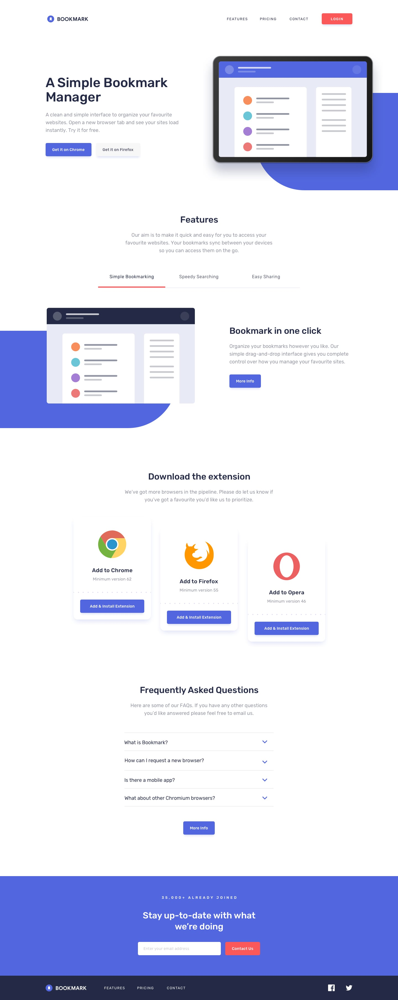
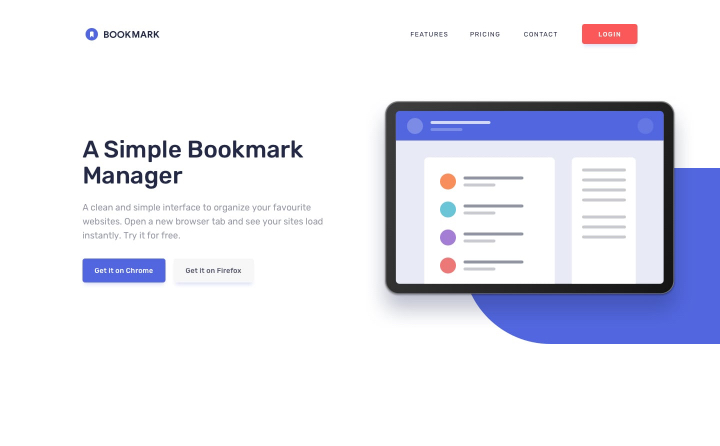
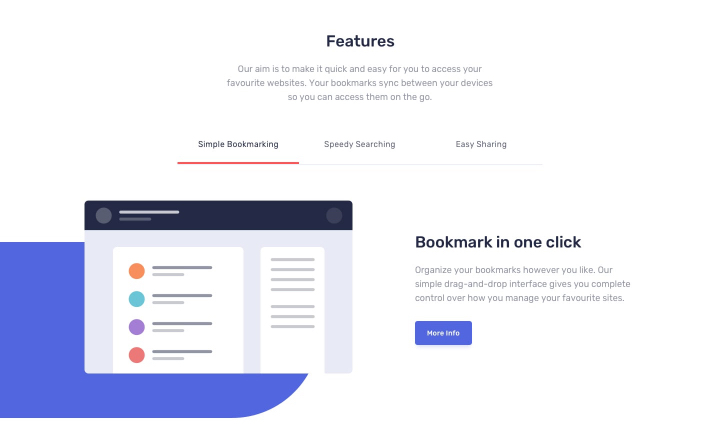
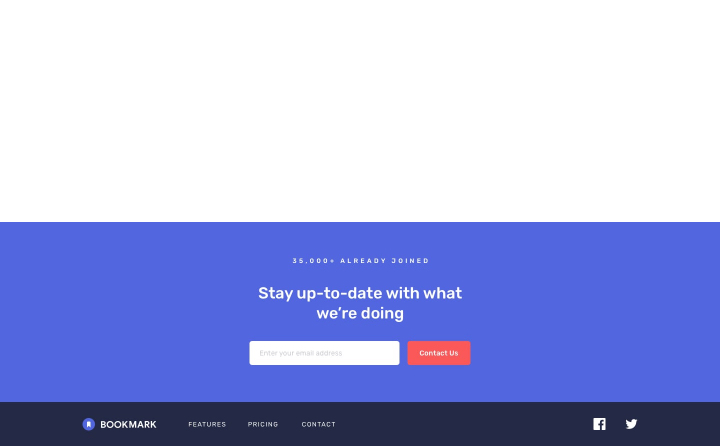

S2. Bootstrap&SASS
------------------

Descripció
----------

El teu repte és construir una _landing page_ i fer que sembli el més possible a aquest disseny:

  

  

  

El disseny per a mòbil ha de quedar així:

  
  
  

Has d'utilitzar **Bootstrap 5 i SASS** per a generar els teus estils CSS.

**Important**

En **\-> [aquest link](./design/Recursos projecte sprint 2-20221009.zip)** tens els recursos per crear la web.

  

#### Indicacions per a Bootstrap:

\- Fer servir sempre que es pugui els **components de Bootstrap**, com per exemple els botons, _cards_, _navs_, _tooltips_... això t'estalviarà temps i la teva web guanyarà consistència. Aquí tens els components Bootstrap **\->[components accordion/](https://getbootstrap.com/docs/5.0/components/accordion/)**

\- **No modifiquis mai** les classes dels arxius **originals de Bootstrap**!

\- Posicionar els elements amb les classes de marges i paddings de Bootstrap. Per a projectes grans, aquesta pràctica simplifica molt els arxius CSS, a més que llegint l'HTML ja pots saber com està posicionat en poder veure les seves classes. Per saber més d' **\-> [utilities spacing de Bootstrap](https://getbootstrap.com/docs/5.0/utilities/spacing/)**

\- **Personalitzar el tema de Bootstrap** per defecte per a adaptar-ho als estils de la web que estàs creant mitjançant SASS. No fa falta crear classes noves, pots ajustar Bootstrap per a adaptar-ho a les teves necessitats: _paddings_ per defecte, colors del tema, marges...  
Molt recomanable que vegis aquest vídeo curt de com modificar les variables per defecte que porta Bootstrap:

](https://youtu.be/nCX3QVl_PiI)

Nivell 1
--------

### \- Exercici 1

En aquest exercici començarem per la part principal, que és el contingut que veuen els usuaris en entrar a la web:

  

  

  

Per a això hauràs d'implementar:

\- La **barra de navegació** superior fixa, utilitzant el component "navBar" de Bootstrap.

**\->[Components navbar](https://getbootstrap.com/docs/5.0/components/navbar/)**

\- El **contingut principa**l, fent servir el "grid responsive" que proporciona Bootstrap per dividir la pantalla en dues columnes, a l'esquerra com pots veure està l'eslògan, la descripció i els botons, i en la columna dreta la imatge.

**\->[Grid system](https://getbootstrap.com/docs/5.0/layout/grid/)**

  

**Important**

Abans de començar a muntar la web, hauràs de veure el vídeo recomanat anteriorment, per a aprendre a instal·lar Bootstrap en el teu projecte fent servir el gestor de paquets npm.

* * *

#### Requisits mínims: 

\- Instal·lar Bootstrap al projecte, no fer servir cdn (que és càrrega mitjançant per link, com per exemple "<link href="https://cdn.jsdelivr.net/npm/bootstrap@5.0.2/...." rel="stylesheet" crossorigin="anonymous">").

\- Fer servir component navBar de Bootstrap.

\- Fer servir Grid Responsive de Bootstrap, ja que s'ha de veure bé en tauleta i mòbil.

\- Modificar amb SASS, mitjançant l'arxiu creat per tu "main.scss", el color principal i secundari de Bootstrap. Utilitza aquestes variables pels color dels botons  

*   Color principal: #5265E1
*   Color secundari: #FA5959. 

  

### \- Exercici 2

Ara toca crear la part de funcionalitats del producte que estem venent:

  

  
  
  

#### Requisits mínims:

  
  
\- L'apartat "Features", amb el text descriptiu, ha d'anar dins del **Grid de Boostrap**.

\- Has d'utilitzar el **component tabs** de Bootstrap, modificant els seus estils per adaptar-los a la nostra web

**Per saber més**

En aquest tutorial ensenya com fer-ho.**\-> [How to Style Bootstrap Tabs Step-by-Step](https://turbofuture.com/computers/Apply-custom-styles-to-bootastrap-tabs-step-by-step)**

\- **Responsive.**

  

### \- Exercici 3

Has de construir la tercera part de la web: l'àrea de descàrregues:

  

  

  

  
Com les cards de la imatge són molt diferents a les cards de Bootstrap, en aquest exercici et donem la possibilitat de, o bé personalitzar les cards de Bootstrap o bé crear les teves pròpies classes per maquetar-les.

  

#### Requisits mínims:

\- Responsive.

\- Botons de Bootstrap de color primary definit en l'exercici 1.

  

### \- Exercici 4

ENHORABONA! Ja gairebé tens el nivell 1 completat! Ara toca desenvolupar l'apartat de FAQS:

  

  

  

#### Requisits mínims

\- Fer servir el component "Accordion" i personalitzar les classes per a adaptar-lo al disseny.

\- Responsive.

\- Botó de Bootstrap.

  

Nivell 2
--------

  

  

  

COMPTE! **abans de passar al nivell 2 verifica que has entès bé tots els exercicis del nivell 1**. 

El nivell 2 i 3 són opcionals, l'important és aprendre els conceptes de cada sprint, si l'has copiat ràpid d'internet no té valor, ja que si passes així tots els sprints, hauràs treballat molt i après poc. 

En una entrevista tècnica en una empresa o en les proves de nivell de l'itinerari (després del sprint 5 i 9) es detecta molt ràpid aquests casos. No retardis el teu aprenentatge, **millor fer pocs exercicis bé que molts ràpids.**

  

  

### \- Exercici 5  

Només falta un bloc per acabar la web: el footer.

  

  

  
  

#### Requisits mínims

\-

\- Fer servir els formularis de Bootstrap.

\- Mostrar un **missatge d'error** quan el formulari del butlletí de notícies s'envia, i el camp d'entrada és buit o l'adreça de correu electrònic no està formatada correctament. S'ha de fer amb Bootstrap.

**Per saber més**

Sobre formularis de Bootstrap **\->[forms overview](https://getbootstrap.com/docs/5.0/forms/overview/)**

Més informació de com validar formularis amb Bootstrap **\->[aquí](https://www.w3schools.com/bootstrap5/bootstrap_form_validation.php)**

###   

Nivell 3
--------

### \- Exercici 6  

Modificar els estats actius dels botons, links, tabs i avisos de la web, perquè quedin així quan es passi el cursor per sobre:

  

  

  

### \- Exercici 7  

  
Com has implementat el posicionament de les cards de descàrregues de l'exercici 3? Has creat una classe o id per a cada card?:

  

  
  
  

Per pocs elements no suposa molta feina, però que passaria si tinguessis una web plena de cards, les quals vols estilitzar en funció de la seva posició?, hauries de crear massa classes!

  
En aquest exercici hauràs de posicionar les targetes de l'exercici 3 utilitzant **l'herència de SASS** conjuntament amb la **pseudo-classe nth-child** (en aquest cas podem utilitzar nth-child(1), nth-child(2) i nth-child(3) per simplificar l'exercici).

  

Recordatoris
------------

\- **És obligatori pujar tots els lliuraments almenys amb el nivell 1** al final de l'sprint per a poder passar al següent.

\- Els **lliuraments es faran a ser possible el dimecres o dijous de la segona setmana de l'sprint.** 

\- Com a molt tard el lliurament es farà el dilluns següent a la finalització de l'sprint, dia que comença el nou sprint.

\- Si vols **avançar al següent sprint abans d'hora**, has de finalitzar els tres nivells de la tramesa.

  

Recursos
--------

  

  
  

**IMPORTANT: En **\-> [aquest link, tens els recursos](https://itacademy.barcelonactiva.cat/mod/folder/view.php?id=6040)** per a poder crear la web.**